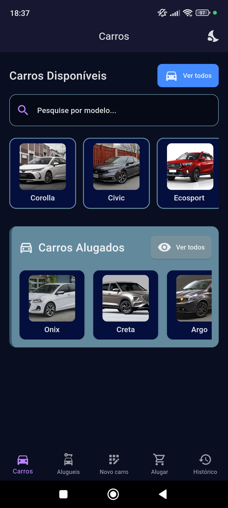
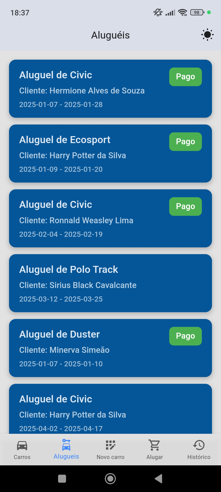

# ConnectCar - Gerenciamento de Aluguéis de Carros
O ConnectCar é um aplicativo desenvolvido para facilitar o gerenciamento de aluguéis de carros. Ele permite o cadastro de clientes e carros, a realização de aluguéis, e o controle de datas e valores. O aplicativo oferece uma interface moderna e intuitiva, com suporte a temas claros e escuros, e gerenciamento de estados eficiente utilizando Riverpod.

---

# Funcionalidades
- **Cadastro de Clientes:** Permite adicionar clientes.
- **Cadastro de Carros:** Registra carros disponíveis para aluguel, com informações como modelo e placa.
- **Realização de Aluguel:** Facilita o processo de aluguel, onde é possível selecionar clientes, carros e definir datas de retirada e devolução.
- **Orçamento:** Calcula e exibe o valor do aluguel com base nas datas de retirada e devolução.
- **Temas Claro e Escuro:** O app oferece a opção de alternar entre os modos claro e escuro, com a escolha persistida usando o Hive.
- **Gerenciamento de Estado com Riverpod:** O gerenciamento de estado é feito de maneira eficiente e escalável utilizando o Riverpod.

---

# Tecnologias Utilizadas
- **Flutter:** Framework para desenvolvimento mobile utilizado no projeto.
- **Drift:** Banco de dados local utilizado para persistir informações sobre clientes, carros, aluguéis e pagamentos.
- **Hive:** Utilizado para persistir o estado do tema (claro ou escuro) localmente.
- **Riverpod:** Biblioteca para gerenciamento de estado, permitindo um controle eficiente e reativo das mudanças de estado no aplicativo.

---

# Imagens do aplicativo
- Abaixo estão algumas imagens do aplicativo ConnectCar em funcionamento:

- **Tela inicial:** 

- **Alugueis:**

- **Detalhes do aluguel:**

- **Histórico de alugueis:**

